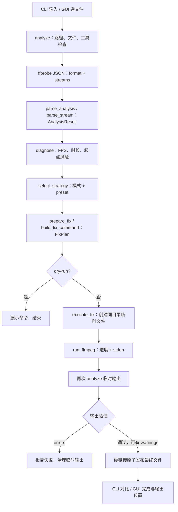

# V2 基线报告：V1 架构与真实 Steam 录屏兼容性

日期：2026-09-07。代码基线：`d639dfac0a97dd313350410eb92af57faec61df8`（`main`）。

本阶段只调查。未修改核心代码、GUI、测试或修复规则；未执行真实样本的修复计划，未生成正式修复结果。已阅读项目规范：仓库实际文件名为 `AGENTS.md.txt`，不存在单独的 `AGENTS.md`。

**结论：颜色信息在 Python 模型层缺失，编码参数没有建立明确的颜色范围策略，而 Bilibili 验证依赖像素格式字符串严格相等。三者组合可以解释已报告的 full-range 输入转码后被拒绝。现有 394 项测试全部通过，但没有覆盖这一真实 HEVC 输入路径。**

## 1. 运行环境与只读证据

环境：Windows、项目本地 Python 3.13.5、PySide6 6.11.2、FFmpeg/ffprobe `9.0.1-essentials_build-www.gyan.dev`。工具来自项目 `tools/ffmpeg/bin`，本次未安装或更新依赖。

真实样本：`PRIVATE_RECORDING.mp4`（公开报告使用匿名标识；原始路径、哈希及时间戳保留于本地证据）。

| 属性 | 本次实际读取结果 |
| --- | --- |
| 文件大小 | 502,018,281 字节 |
| 容器 | MP4；`major_brand=isom` |
| 容器时长 | 123.496333 秒 |
| 视频轨 | 1 条，index 0；HEVC / H.265，`profile=Main`，`hvc1` |
| 分辨率 | 2560 × 1440；SAR 1:1 |
| 像素格式 | `yuvj420p` |
| 颜色范围 | `color_range=pc`，full range |
| 矩阵 / 原色 / 传递特性 | `color_space=bt709` / `color_primaries=bt709` / `color_transfer=bt709` |
| 位深 | 8-bit；HEVC SPS 的 luma/chroma `bit_depth_*_minus8` 均为 0 |
| 平均 / 标称 FPS | `990612379/16512317` ≈ 59.992330513 / `60/1` |
| 视频时长 / 起点 / time_base | 123.382438 秒 / 0 秒 / `1/1000000` |
| 视频帧数 | ffprobe `nb_frames=7402` |
| 音频轨 | 1 条，index 1；AAC LC、48,000 Hz、双声道 |
| 音频时长 / 起点 / time_base | 123.477333 秒 / 0.019 秒 / `1/48000` |
| 两轨时长差 | 0.094895 秒；V1 判为轻微风险 |

没有把音频的 `bits_per_sample=0` 当作视频位深。视频流 JSON 没有提供独立的 `bits_per_raw_sample`，本次通过码流头部确认 8-bit。BT.709 和 full-range 的组合本身不等于 HDR，也不能仅凭 `yuvj420p` 判为损坏视频。

使用了三层只读证据：

1. `ffprobe -v quiet -print_format json -show_format -show_streams` 读取容器与轨道信息。
2. FFmpeg 解码开头少量帧，经 `showinfo` 输出帧属性，送往 `-f null -` 丢弃；没有媒体落盘。帧属性同样是 `yuvj420p(pc, bt709)`。命令限制输出 10 帧，滤镜日志含预读到的第 11 帧，不能据此声称全片解码完成。
3. FFmpeg `-c:v copy -bsf:v trace_headers -frames:v 1 -f null -` 只检查 HEVC 头部：`video_full_range_flag=1`，亮度/色度位深均为 8，原色、传递特性、矩阵编号均为 1。另用 ffprobe 只读扫描视频包时间戳。

原文件分析前后 SHA-256、字节数及 `mtime_ns` 完全一致：

```text
SHA-256: [私有样本哈希保留于本地证据；校验一致]
mtime_ns: [原始值保留于本地证据；校验一致]
```

## 2. 当前架构与模块定位

| 职责 | 位置与主要入口 |
| --- | --- |
| CLI | `main.py` → `app/cli.py:209 main`；`run_fix` 组织展示和执行 |
| 工具发现与 ffprobe | `app/ffmpeg_utils.py:63 find_tool`、`:106 check_tools`、`:114 probe_media` |
| Analyzer | `app/analyzer.py:198 analyze`、`:123 parse_analysis`、`:97 parse_stream`、`:152 diagnose` |
| 模型 | `app/models.py`：`StreamInfo`、`AnalysisResult`、`SyncDiagnosis`、`RepairStrategy`、`FixPlan`、`OutputValidation`、`FixResult` |
| 策略与修复编排 | `app/fixer.py:44 select_strategy`、`:103 prepare_fix`、`:130 execute_fix`；`:34 select_target_fps` |
| FFmpeg command builder | `app/ffmpeg_utils.py:132 build_fix_command`；实际进程执行在 `:266 run_ffmpeg` |
| Preset | 名称与默认值在 `ffmpeg_utils`，策略约束在 `fixer.select_strategy`，编码约束在 builder，标签与验证报告在 `app/presets.py` |
| Validator | Bilibili：`app/presets.py:14 validate_bilibili_output`；通用：`app/fixer.py:163` 开始的另一条分支。没有独立 `validator.py` |
| GUI | `gui.py` → `gui/main_window.py:313 launch`；界面用 `gui/workers.py:12 MediaWorker(QThread)` 调用现有核心 |
| 测试 | `tests/test_analyzer.py`、`test_diagnosis.py`、`test_fixer.py`、`test_ffmpeg_utils.py`、`test_strategies.py`、`test_presets.py`、`test_cli.py`、`test_gui.py`；真实工具测试位于三份 integration/generated 测试文件 |
| 合成样本工具 | `tests/generate_samples.py`、`tests/media_helpers.py`、`tests/test_sample_generation.py` |
| 项目支持文件 | `.gitignore`、`pytest.ini`、两份 requirements、README、CODE_REVIEW、项目规范 |
| 本地运行目录 | `.venv/`、`tools/ffmpeg/`、`tmp/`、`samples/`、`output/`、`tests/generated_samples/`；环境、大型媒体、缓存被 Git 忽略 |

Preset 规则分布在上述几个模块，当前分工仍可理解；GUI 没有复制命令构建或转码业务。V2 需要同时审视模型、策略、builder 和 validator，而不是只改一条输出参数。

## 3. 完整处理流程



上图展示修复分支。CLI 未传 `--fix` 或 GUI 只选择文件时，流程在分析与报告后结束；`dry-run` 是 CLI 功能，GUI 当前没有对应入口。

输入阶段解析所有非封面视频轨和音轨；默认诊断比较第一条视频与第一条音频。策略阶段 safe 会逐音轨比较风险。修复只导出第一条非封面视频轨，保留全部音轨并逐轨编码，不混音；额外视频轨有提示。

命令通过 subprocess 参数列表运行，不经过 shell。转码先写到 `output/.avsync-*/<stem>_fixed.mp4`，校验成功才发布 `output/<stem>_fixed.mp4`。已有输出拒绝覆盖；普通失败回收临时目录。

GUI 选择文件和开始修复都会在 worker 中分析；后者重新读文件，避免旧元数据。验证报告经信号返回主线程显示。验证失败由 `MediaError` 转为界面错误，进度条归零，不提供最终输出目录按钮；这解释了此前截图中的“有输出验证报告但进度 0%”。

## 4. 当前颜色信息处理路径

| 信息 | ffprobe 原始 JSON | Python 模型 / Analyzer | 策略与 FFmpeg 参数 | 输出验证 / 展示 |
| --- | --- | --- | --- | --- |
| `pix_fmt` | 有读取 | `parse_stream` → `StreamInfo.pixel_format`，保留字符串 | 不按输入值分支；统一 `-pix_fmt yuv420p` | Bilibili 要求严格相等并展示；通用没有像素格式检查；输入 CLI/GUI 摘要不展示该字段 |
| `color_range` | 有读取 | 未建模，解析时不保留 | 无显式范围转换或输出范围策略 | 不检查、不展示 |
| `color_space` | 有读取 | 未建模 | 未显式设置 `-colorspace` 或矩阵转换 | 不检查、不展示 |
| `color_primaries` | 有读取 | 未建模 | 未显式设置原色或转换 | 不检查、不展示 |
| `color_transfer` | 有读取 | 未建模 | 未显式设置 `-color_trc` 或传递函数转换 | 不检查、不展示 |
| `codec` | `codec_name` | 保存到 `StreamInfo.codec` | 输入解码交给 FFmpeg；输出统一 libx264 / AAC | Bilibili 和通用都检查 H.264/AAC；CLI 显示输入 codec |
| `profile` | 样本含 Main / LC | 未建模 | 没有显式输出 profile/level，交给编码器选择 | 不检查、不展示 |
| bit depth | 本例视频字段缺失；头部可分析 | 不读取 `bits_per_raw_sample`、不从格式描述/码流求位深 | `yuv420p` 目标隐含 8-bit，无 10-bit 输入策略、抖动或 HDR 色调映射策略 | 没有独立位深验证 |

关键区别：Python 不保留颜色字段，不代表 FFmpeg 会丢弃这些字段。FFmpeg 仍直接重新打开原媒体，解码帧和编码上下文可能继续携带颜色属性；Python 当前既没有明确管理这些属性，也没有验证它们。

当前滤镜只显式处理时间戳、帧率和通用模式的奇数尺寸补边。没有显式 `scale` 范围转换、`zscale`、`colorspace`、`setrange`、`setparams` 或 tone mapping。FFmpeg 可能为了像素格式协商自动插入转换，不能由此推断已经正确完成 full → limited 的数值和标记转换。

## 5. 当前策略与 FFmpeg 参数

### 5.1 通用参数和条件参数

所有实际修复均重新编码，即使 safe 没有选择专项修复。

| 分类 | 当前参数 / 条件 |
| --- | --- |
| 执行与失败 | `-hide_banner -loglevel warning -xerror -nostdin -n` |
| 轨道 | 第一条非封面视频对应的 `-map`，所有音轨分别 `-map`；无音轨时 `-an` |
| 视频 | `-c:v libx264 -preset medium -crf 18 -pix_fmt yuv420p` |
| 音频 | `-c:a aac -b:a 192k`；Bilibili 增加 `-ar 48000` |
| CFR | `setpts=PTS-STARTPTS,fps=fps=<目标>,setpts=N/(<目标>*TB)+<相对偏移>/TB` |
| 输出帧同步 | `-fps_mode:v passthrough`；CFR 已由 fps 滤镜生成，passthrough 避免后级再次补帧抹掉合法起点偏移 |
| 非 CFR | 增加 `-enc_time_base:v filter`，保留滤镜时间基 |
| Timestamp | 输入前 `-fflags +genpts`，输出 `-avoid_negative_ts make_non_negative`；没有 copyts/start_at_zero |
| Audio-sync | 选中音轨使用 `aresample=async=1:min_hard_comp=0.1:max_soft_comp=0`；按 PTS 补缺口/裁重叠，不按总时长比例拉伸 |
| 几何 | 通用加 `pad=ceil(iw/2)*2:ceil(ih/2)*2`；Bilibili 不补边，未知或奇数宽高直接拒绝，输入前加 `-noautorotate` |
| 容器与进度 | `-map_chapters -1 -movflags +faststart -progress pipe:1 -stats_period 0.5 -nostats -f mp4` |

### 5.2 本样本在 V1 中实际选出的策略（仅构建，未执行）

| 模式 | 通用 preset | Bilibili preset |
| --- | --- | --- |
| safe | 仅兼容性转码，不强制 CFR，不开 timestamp/async | CFR 60，无 timestamp/async |
| cfr | CFR 60 | CFR 60 |
| timestamp | timestamp，不强制 CFR | CFR 60 + timestamp |
| audio-sync | 音轨 1 async，不强制 CFR | CFR 60 + 音轨 1 async |

原因：FPS 差 0.007669487 小于 0.1；轨道差 0.094895 小于 safe 开启 async 的 0.2 秒；起点差 0.019 小于 0.05 秒，且起点已知非负。颜色属性完全不参与这些决策。

此前截图所选 `audio-sync + bilibili` 的 V1 参数如下。**这是从当前 builder 得到的未执行计划，仅输出目的地用占位符表示。**

```text
ffmpeg -hide_banner -loglevel warning -xerror -nostdin -n
  -noautorotate -i "PRIVATE_RECORDING.mp4"
  -map 0:0 -map 0:1
  -vf "setpts=PTS-STARTPTS,fps=fps=60,setpts=N/(60*TB)+0.000000000/TB"
  -fps_mode:v passthrough -c:v libx264 -preset medium -crf 18 -pix_fmt yuv420p
  -c:a aac -b:a 192k -ar 48000
  -filter:a:0 "asetpts=PTS-STARTPTS,aresample=async=1:min_hard_comp=0.1:max_soft_comp=0,asetpts=PTS+0.019000000/TB"
  -map_chapters -1 -movflags +faststart
  -progress pipe:1 -stats_period 0.5 -nostats -f mp4 <临时输出路径>
```

## 6. 为什么仍可能得到 yuvj420p

需要区分三件事：像素存储格式、像素数值的颜色范围、编码码流/容器的范围标记。`-pix_fmt yuv420p` 不是“颜色范围已转换并正确标记”的完整保证。

证据与推理链：

1. **已实测的输入事实**：容器探测、解码帧和 HEVC 头部均指向 full-range、8-bit 4:2:0。
2. **已确认的 V1 代码事实**：只指定像素格式，没有颜色模型和范围转换策略；时间戳、fps、音频滤镜不解决视频颜色范围。
3. **FFmpeg 的机制**：YUVJ420P 是历史上的全范围 4:2:0 表示，现代表示可以把像素格式与 `color_range` 分开。libx264 封装在颜色范围明确时，会据编码上下文的 `color_range` 设置 H.264 VUI full-range 标记。因此内部选择 yuv420p 并不排除输出码流继续携带 full-range。参见 [像素格式定义](https://www.ffmpeg.org/doxygen/trunk/pixfmt_8h.html) 与 [libx264 实现中的范围设置](https://ffmpeg.org/doxygen/trunk/libx264_8c_source.html#l01356)。
4. **结合既有截图的判断**：输出被 ffprobe 报告为 yuvj420p，与 full-range 属性继续进入编码/探测路径相符。最直接的代码缺口是没有明确管理数值转换及范围标记，而不是输入解码器不认识 HEVC。

本轮没有重编码真实样本，所以不能把上面的机制分析说成本轮重新复现了输出失败，也没有测量此前输出的像素值，不能断言此前输出已经发灰、变暗或颜色正确。输入 full-range 本身有效；这次失败是项目本地预设校验拒绝，不是 Bilibili 平台实际返回的拒绝。

V2 的调查结论是要分别定义并验证数值转换与标记含义，不能只改字符串或只重新贴标签。FFmpeg 的 `setrange` 是属性标记，而 `scale` 支持范围转换；两者用途不同。参见 [setrange 文档](https://www.ffmpeg.org/ffmpeg-filters.html#setrange) 和 [scale 文档](https://www.ffmpeg.org/ffmpeg-filters.html#scale)。本阶段未选定或实施修复参数。

## 7. 当前输出验证规则与拒绝原因

| 项目 | Bilibili | 通用 |
| --- | --- | --- |
| 容器 | 格式列表含 mp4，且 major_brand 为 iso 开头或 mp41/mp42/avc1/m4v | 没有独立容器检查 |
| 视频编码/数量 | 必须恰好 1 条 H.264 | 必须有视频，首条为 H.264 |
| 像素格式 | 必须字符串等于 `yuv420p` | 不检查 |
| 分辨率 | 必须等于输入首条视频尺寸 | 不在输出阶段检查 |
| FPS | avg 与 r 转浮点后均严格等于目标整数 FPS | 仅启用 CFR 时做同样检查 |
| 音轨 | 数量与输入一致，逐轨 AAC / 48 kHz | 数量一致，逐轨 AAC |
| 视频/音轨时长 | 未知或音视频差 ≥ 0.2 秒给 warning，不硬性拒绝 | 没有对应发布门槛 |
| 起始时间 | 未知、负起点或两轨偏移 > 0.05 秒给 warning | 没有对应发布门槛 |
| color_range / 矩阵 / 原色 / 传递特性 | 不检查 | 不检查 |
| profile / 独立位深 | 不检查 | 不检查 |
| 实际画面颜色、完整内容、声音画面同步 | 无内容级验证 | 无内容级验证 |

直接拒绝条件是 `app/presets.py:26`：

```python
if video.pixel_format != VIDEO_PIXEL_FORMAT:
    errors.append(...)
```

常量在 `app/ffmpeg_utils.py:23` 为 `yuv420p`。输出 `yuvj420p` 即产生 error；`execute_fix` 先回调报告，再抛出 `MediaError`，不执行硬链接发布，退出临时目录后清理文件。

这条规则对“项目定义的目标字符串”严格，但对颜色含义覆盖不足：不认识范围语义，也无法识别“字符串满足而范围/像素数值不一致”的情况。改用通用 preset 可能避开字符串拒绝，但不能据此证明颜色问题已解决。

## 8. 现有测试覆盖与缺口

已阅读样本构造、真实工具测试、预设测试与其他测试入口，并检索全部测试文件中的颜色/编码相关字段。

| 场景 | V1 覆盖情况 |
| --- | --- |
| 真实 HEVC 输入 | **无**。`test_presets.py:124` 的 hevc 是模拟不合规输出，应被 H.264 规则拒绝，不是 HEVC 输入转码测试 |
| yuvj420p 输入或输出 | **无专门用例** |
| 明确 full-range 输入 | **无**；没有配置或断言 `color_range=pc/full` |
| 明确 limited-range 输入 | **没有范围语义的专项覆盖**。现有 lavfi → H.264/yuv420p 路径间接经过通常的默认范围处理，但没有显式设置/检查 tv；本地现存 cfr/vfr 样本探测时 range 字段甚至缺失 |
| full → limited 数值转换 | **无**；没有黑白/灰阶数值、范围标记与显示一致性断言 |
| limited → limited 不重复压缩 | **无** |
| 矩阵、原色、传递特性保留或转换 | **无** |
| HEVC Main10 / 10-bit / HDR | **无** |
| yuv444p → yuv420p | **有真实转码测试**：`test_fix_integration.py` 的 upload/odd_size；不等于范围转换覆盖 |
| 像素格式缺失与不合规输出 | **有 mock 测试**：None、yuv444p；未覆盖 yuvj420p/range 组合 |
| CFR/VFR、音频长短/缺失、时戳偏移、多音轨、旋转、损坏、源文件与发布安全、GUI 线程 | **有既存单元/集成测试**，属于当前 394 项基线 |

五类六秒样本全部由 `testsrc2 + libx264 + yuv420p` 生成，变化主要是帧时间和音频长度。其他主要真实视频 fixture 也使用 libx264。样本数量和参数化测试数量不等于输入编码/颜色组合的多样性。

另外，`tests/test_presets.py:52` 将“保持原分辨率”实现为禁止滤镜字符串含 `scale=`。这条现有测试没有区分几何缩放与同尺寸颜色范围转换；将来实现范围处理时，需要重新审视它约束的语义，而不是为了通过测试避开正确的转换。本轮未修改该测试。

## 9. V2 优先兼容性风险

1. **最高优先：颜色数据模型、转换策略、输出校验不一致。** 会导致本例这种转码后才失败，也可能让属性字符串满足的错误颜色输出被接受。需要覆盖 full、limited、未知/冲突标签，以及不同 FFmpeg 版本的格式命名。
2. **高优先：真实帧时间变化被平均值掩盖。** 本例 7,402 个视频包的展示 PTS 排序后，相邻间隔最小 8,546 μs、最大 50,742 μs、中位数 15,314 μs，共 2,580 种间隔，无重复 PTS。开头解码帧也证实间隔变化，不只是 B 帧的包解码顺序。V1 却因平均/标称 FPS 差 < 0.1 不启用通用 safe 的 CFR；Bilibili 依靠预设强制 CFR 避免这一决策漏项。时间轴变化不自动证明声音画面不同步。
3. **高优先：HEVC Main10/HDR 与 SDR 的边界未知。** 当前无位深、transfer/primaries 策略，统一 8-bit 目标不能代替 HDR→SDR 处理；也不能把本次 8-bit BT.709 full-range 样本误归入 HDR。需要先界定支持范围。
4. **高优先：成功定义偏重元数据。** 当前校验不能证明画面颜色、内容完整和真实同步；0.094895 秒轨道长度差也不能证明音频需要拉伸。async 补缺口不等于校准所有录制时钟漂移。
5. **中优先：长时高分辨率与失败成本。** 本例约 479 MiB、1440p/60，明显超出主要 1～6 秒低分辨率合成样本的负载。GUI 无取消，失败可能发生在完整转码之后；现有严格解码错误策略也需要在真实长录屏上评估，但本阶段未调整。
6. **中优先：工具版本、profile/level、文件系统和媒体元数据组合。** 输出 profile/level 未单独约束；原子发布依赖硬链接；本机通过不能替代其他 FFmpeg 构建、设备和目标播放器验证。章节/字幕/额外视频轨不保留属于现有限制。

本例视频最早 DTS 为 -30,267 μs，视频包 DTS 严格递增。编码重排可出现负的开头 DTS；这个观测本身不是损坏证明。V1 的 timestamp 风险依据 stream start_time 等元数据，并未扫描包 DTS。

## 10. 测试结果、产物与边界

执行当前完整测试集：

```powershell
.\.venv\Scripts\python.exe -X utf8 -m pytest -q -o junit_family=xunit1 --junitxml=tmp/v2-baseline-tests.xml
```

**394 passed，0 failed，0 errors，0 skipped；耗时 108.09 秒。** 没有新增、删除或修改测试，没有因失败修改核心行为。集成测试生成的媒体仅为既有合成 fixture，真实 `test.mp4` 没有加入转码测试。

本轮新增此报告。只读分析证据位于已忽略的本地目录 `tmp/v2-baseline/`：

- `input-ffprobe.json`：完整输入容器和轨道 JSON。
- `decode-showinfo.log`、`hevc-headers.log` 及对应 command JSON：解码属性和头部证据。
- `video-packets.json`、`packet-summary.json`：视频包时间戳与统计。
- `source-before.json`、`source-after.json`：前后哈希、大小、修改时间。
- `v1-plans-not-executed.json`：八种模式/preset 组合的策略和完整参数列表；仅生成计划，未执行。
- `libx264-help.txt`、`cfr-existing-sample-probe.json`、`vfr-existing-sample-probe.json`：本机能力和既存合成样本检查。

完整测试机器报告在 `tmp/v2-baseline-tests.xml`。本次没有推送仓库，没有把真实视频复制进项目，没有生成该样本的修复输出。所有 V2 修复方案仍待下一阶段实施和验证。

## 11. 基线复查记录

同日按要求再次运行全部现有测试：**394 passed，0 failed，0 errors，0 skipped；耗时 113.29 秒**。机器报告为 `tmp/v2-baseline-recheck-tests.xml`，执行命令仅将上面的 `--junitxml` 路径换为该文件。

复查确认：

- `app/`、`gui/`、入口和测试仍与 V1 提交一致，上一步没有新增业务实现。
- 八组记录的命令参数与当前 builder 重新构建的结果完全一致；仅构建，没有执行真实样本转码。
- 帧间隔统计由原始包 JSON 重新计算后一致，保存的源文件前后身份记录一致。
- 产品代码没有写死本机用户目录、盘符或真实样本路径；报告里的路径和数字是案例证据。风险阈值、常见 FPS 和主要编码参数已有集中常量。
- 未发现新增的重复业务逻辑或需要在本阶段修复的明显回归；命令构建仍集中在核心，GUI 通过 worker 复用核心。不同预设的验证规则差异和显示精度差异不作为重复代码强行合并。
- 本轮只补充报告中的“仅分析 / 修复分支”和 CLI dry-run 适用范围说明，并记录复查结果；没有修改核心行为。

稳定性结论仅限于当前自动测试覆盖范围。已确认的 full-range 兼容问题、VFR 判断局限及颜色测试缺口仍然存在，未在基线阶段修复。
